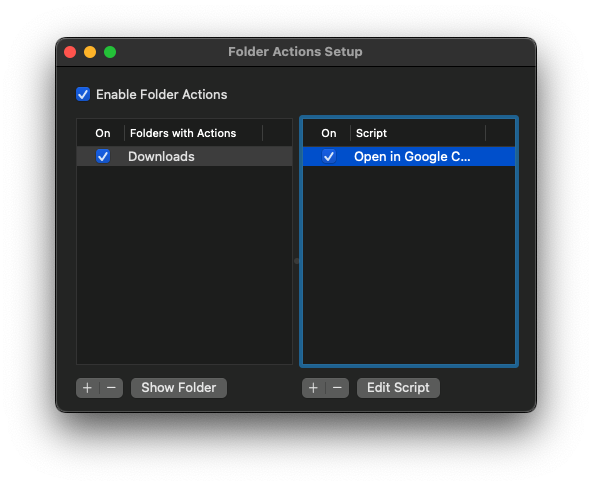

# Open In Google Calendar

Open `.ics` calendar files in Google Calendar on macOS.

This project installs:

- a Folder Action script you can attach to `Downloads`
- an app for opening `.ics` files directly

## Install

```sh
./install-open-in-google-calendar.sh
```
The app will ask
```
Set "Open in Google Calendar" as the default app for .ics files? [y/N]
```
If you want this action to be the default, press `Y`, otherwise press `N`. You should now see the following:
```
Installed:
  /Users/dagfev/Library/Scripts/Folder Action Scripts/open - in Google Calendar.scpt
  /Users/dagfev/Applications/Open in Google Calendar.app
```
The installer will proceed to open the `Folder Actions Setup`. To automatically process files in the `Downloads` folder you should: 

  1. Enable Folder Actions;
  2. Add `Downloads` to `Folders with Actions`;
  3. Add the script `open - in Google Calendar.scpt` and make sure the `On` box is ticked. 



## Use

- download an `.ics` file into `Downloads`, or
- double-click an `.ics` file

The file opens as a pre-filled Google Calendar event in your browser. The event is not added until you click the `Save` button in the browser.

## Uninstall

Remove:

- `/Users/dagfev/Applications/Open in Google Calendar.app`
- `/Users/dagfev/Library/Scripts/Folder Action Scripts/open - in Google Calendar.scpt`

If you set it as the default opener for `.ics` files, change the default app in Finder afterwards.
